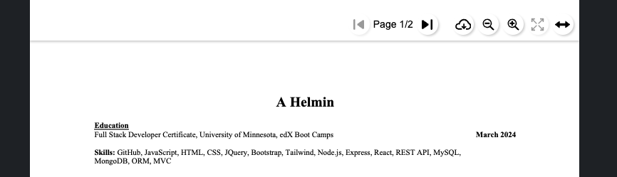

# React Portfolio

## Description

React Portfolio is a front-end app meant to be the first version of what is to become my professional portfolio page. Currently, it features the fundamental functionality of futre version. However, this is still an early version and there is more work to be done. While this project has been a great asset for learning React, it could still use more styling, which includes a professional avatar.

## Installation

Installation is not necessary since this has been deployed as a web page.

## Usage

To view the portfolio page simply navigate to https://65e8eb886d9dcd634056f902--kaleidoscopic-cocada-95743e.netlify.app/.

Use the navigation menu to navigate the page.

The portfolio has 4 main sections: About Me, Portfolio, Contact, Resume. The about me section is as it sounds. The portfolio page has 6 different projects that I have worked on as part of a team of alone. Each picture is a link to another page breaking down the tech stack of each product. On the bottom of each picture block are links to the GitHub repo for each project, and if deployed a link to the deployed application.

The contact page is a form to be submitted. Each filed must be filled out and the email field must have a valid email. The submit button is not yet fully functional, but that is to be finished at a future date.

The resume page has a list of proficiencies as well as a pdf version of my resume. This resume is also downloadable as a pdf file. to download click on the cloud download icon. To view both pages, click on the double sided arrow.

## Credits

Thanks goes to the University of Minnesota and Edx Bootcamp for providing the assistance needed to complete this project. 

Picture Credit
From left to right and top to bottom:
Appetizer Pic
From Restaurant HTML Template 
https://www.templateshub.net/template/Elegant-Restaurant-Website

Calendar Pic
Brown-Framed Eyeglasses on a Calendar
https://www.pexels.com/photo/brown-framed-eyeglasses-on-a-calendar-5386754/
Credit: Photo by Leeloo The First

Social Media Pic
Person Holding Iphone Showing Social Networks Folder
https://www.pexels.com/photo/person-holding-iphone-showing-social-networks-folder-607812/
Credit: Photo by Tracy Le Blanc

Employee Tracker Pic
Man Wearing Brown Suit Jacket
https://www.pexels.com/photo/man-wearing-brown-suit-jacket-3184339/
Credit: Photo by fauxels

Weather Dashboard Pic
Water Dew in Clear Glass Panel
https://www.pexels.com/photo/water-dew-in-clear-glass-panel-125510/
Credit: Photo by Kaique Rocha

## License

MIT License

Copyright (c) 2024 helm0127

Permission is hereby granted, free of charge, to any person obtaining a copy
of this software and associated documentation files (the "Software"), to deal
in the Software without restriction, including without limitation the rights
to use, copy, modify, merge, publish, distribute, sublicense, and/or sell
copies of the Software, and to permit persons to whom the Software is
furnished to do so, subject to the following conditions:

The above copyright notice and this permission notice shall be included in all
copies or substantial portions of the Software.

THE SOFTWARE IS PROVIDED "AS IS", WITHOUT WARRANTY OF ANY KIND, EXPRESS OR
IMPLIED, INCLUDING BUT NOT LIMITED TO THE WARRANTIES OF MERCHANTABILITY,
FITNESS FOR A PARTICULAR PURPOSE AND NONINFRINGEMENT. IN NO EVENT SHALL THE
AUTHORS OR COPYRIGHT HOLDERS BE LIABLE FOR ANY CLAIM, DAMAGES OR OTHER
LIABILITY, WHETHER IN AN ACTION OF CONTRACT, TORT OR OTHERWISE, ARISING FROM,
OUT OF OR IN CONNECTION WITH THE SOFTWARE OR THE USE OR OTHER DEALINGS IN THE
SOFTWARE.

